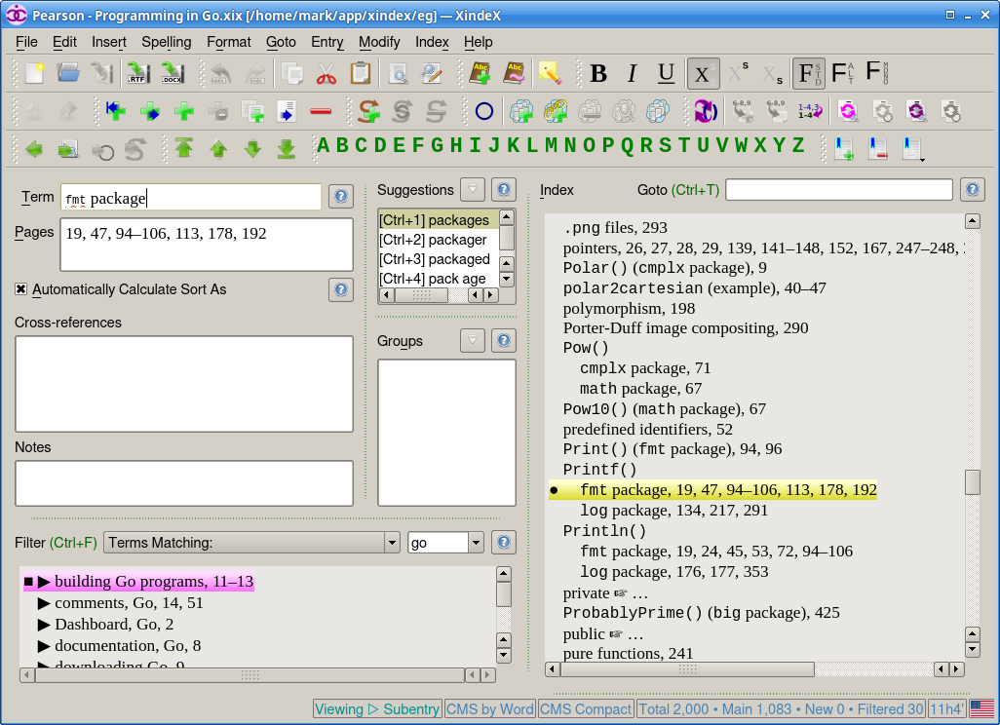

# XindeX

XindeX is an easy to learn and use GUI application for creating, editing,
and outputting indexes (e.g., for books).

First install Python (>= 3.6), and then the Python packages, PySide (i.e.,
PySide1 for Qt 4.8), APSW, and roman, then download and unzip (or clone).

Then run `bin/doc.sh` to generate the documentation. (This requires
txt2tags.)

Then run (or double-click) XindeX.pyw.

It should run fine on Windows but nowadays we only test on Linux.

## License

GPL-3.0.
